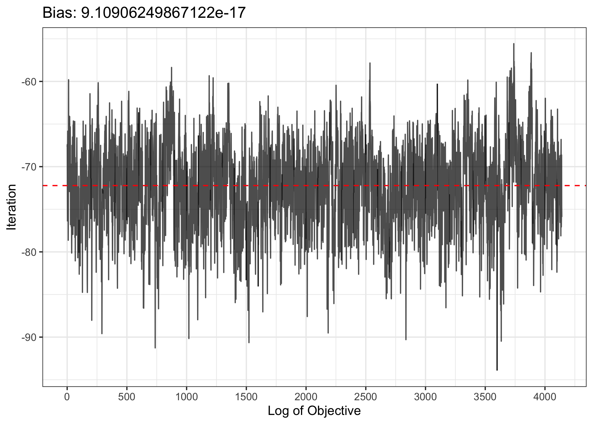
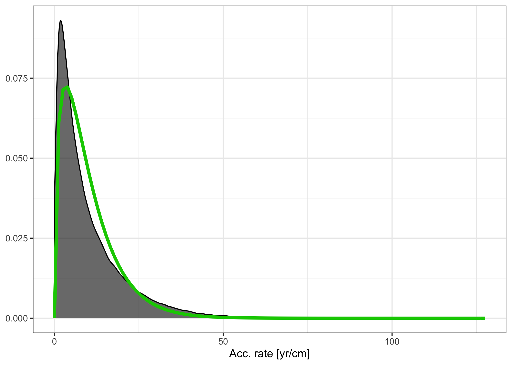

<!-- README.md is generated from README.Rmd. Please edit that file -->

# ageR: Supervised Age Modelling

<!--  -->

<!-- badges: start -->

<!-- [](https://github.com/special-uor/ageR) -->

[](https://github.com/special-uor/ageR)
[](https://github.com/special-uor/ageR/actions)
[](https://cran.r-project.org/package=ageR)
<!-- [](https://codecov.io/gh/special-uor/ageR) -->
<!-- badges: end -->

The goal of ageR is to provide functions that facilitate the creation of
age models using different data sources, including data bases, comma and
tab separated files.

## Installation

<!-- You can install the released version of ageR from [CRAN](https://CRAN.R-project.org) with: -->

<!-- ``` r -->

<!-- install.packages("ageR") -->

<!-- ``` -->

You can install the development version from
[GitHub](https://github.com/special-uor/ageR) with:

``` r
# install.packages("remotes")
remotes::install_github("special-uor/ageR")
```

## Example

### Bacon model

#### Input structure

For an entity X, the input structure should look like

``` r
ageR::file_structure(entity = "X", am = "bacon")
#>                      levelName
#> 1 X                           
#> 2  ¦--Bacon_runs              
#> 3  ¦   °--X                   
#> 4  ¦       ¦--X_depths.txt    
#> 5  ¦       ¦--X_sample_ids.csv
#> 6  ¦       °--X.csv           
#> 7  ¦--hiatus.csv              
#> 8  °--not_used_dates.csv
```

The function `ageR::create_input` can be used to automatically create
the appropriate file structure (as shown previously).

#### Create input structure

1.  Start by creating a data frame for the sampling depths, this should
    have two numeric columns called `id` and `depth`:
    
    ``` r
    sample_depths <- data.frame(id = 1:100,
                                depth = seq(0, 500, length.out = 100))
    knitr::kable(head(sample_depths))
    ```
    
    | id |     depth |
    | -: | --------: |
    |  1 |  0.000000 |
    |  2 |  5.050505 |
    |  3 | 10.101010 |
    |  4 | 15.151515 |
    |  5 | 20.202020 |
    |  6 | 25.252525 |
    

2.  Create a data frame with the core’s data, this should have at least
    four columns. The first column can be of character type and the
    remaining must be numeric. The column names should be `labID`,
    `age`, `error`, and `depth`. Optionally, a fifth column, `cc`, can
    be included to manually select the calibration curve for each
    observation.
    
    ``` r
    core <- data.frame(labID = paste0("X", sprintf("%03d", 1:5)),
                       age = c(50, 200, 1150, 2060, 4050),
                       error = c(10, 15, 5, 1, 70),
                       depth = c(5, 100, 230, 300, 450),
                       cc = 1)
    knitr::kable(core)
    ```
    
    | labID |  age | error | depth | cc |
    | :---- | ---: | ----: | ----: | -: |
    | X001  |   50 |    10 |     5 |  1 |
    | X002  |  200 |    15 |   100 |  1 |
    | X003  | 1150 |     5 |   230 |  1 |
    | X004  | 2060 |     1 |   300 |  1 |
    | X005  | 4050 |    70 |   450 |  1 |
    

3.  (Optional) Create a data frame with the hiatuses depths, this should
    have two numeric columns called `id` and `depth`:
    
    ``` r
    hiatus <- data.frame(id = c(1, 2),
                         depth = c(50, 150))
    knitr::kable(hiatus)
    ```
    
    | id | depth |
    | -: | ----: |
    |  1 |    50 |
    |  2 |   150 |
    

4.  Call the `ageR::create_input` function. The first parameter should
    be a list containing the previous data frames, which must be called
    `sample_depths`, `core`, and `hiatus` (if included). Next, a working
    directory (`wdir`), the entity’s name, and optionally the age
    model’s name (by default is Bacon).
    
    ``` r
    ageR::create_input(data = list(sample_depths = sample_depths, 
                                   core = core,
                                   # Optional
                                   hiatus = hiatus), 
                       wdir = "./", 
                       entity = "X",
                       am = "bacon")
    #> [1] "sample_depths" "core"          "hiatus"
    ```

#### Run Bacon

``` r
ageR::Bacon(wdir = "./", 
            entity = "X", 
            # Optional parameters
            cpus = 1,
            postbomb = 0,
            cc = 0,
            seed = NA,
            alt_depths = NULL,
            quiet = FALSE,
            acc_step = 5,
            acc_lower = NULL,
            acc_upper = NULL,
            thick_step = 5,
            thick_lower = NULL,
            thick_upper = NULL,
            dry_run = FALSE,
            ...)
```

##### Dry-run

Dry-runs are useful to check how many scenarios will be generated with
the current configuration:

``` r
ageR::Bacon(wdir = "./", entity = "X", dry_run = TRUE, quiet = TRUE)
#> The following scenarios will be executed:
#> 
#> 
#> | Accumulation rate| Thickness|
#> |-----------------:|---------:|
#> |                 5|        10|
#> |                10|        10|
#> |                20|        10|
#> |                 5|        15|
#> |                10|        15|
#> |                20|        15|
#> |                 5|        20|
#> |                10|        20|
#> |                20|        20|
#> |                 5|        30|
#> |                10|        30|
#> |                20|        30|
#> |                 5|        40|
#> |                10|        40|
#> |                20|        40|
#> A total of 15 scenarios.
```

##### Change upper and lower bounds

Based on a dry-run, we might want to constraint our execution to a
smaller set of scenarios. This can be done for both accumulation rate
and core segment thickness.

``` r
ageR::Bacon(wdir = "./", entity = "X", acc_lower = 10, acc_upper = 20, dry_run = TRUE, quiet = TRUE)
#> The following scenarios will be executed:
#> 
#> 
#> | Accumulation rate| Thickness|
#> |-----------------:|---------:|
#> |                10|        10|
#> |                20|        10|
#> |                10|        15|
#> |                20|        15|
#> |                10|        20|
#> |                20|        20|
#> |                10|        30|
#> |                20|        30|
#> |                10|        40|
#> |                20|        40|
#> A total of 10 scenarios.
```

``` r
ageR::Bacon(wdir = "./", entity = "X", thick_lower = 10, thick_upper = 30, dry_run = TRUE, quiet = TRUE)
#> The following scenarios will be executed:
#> 
#> 
#> | Accumulation rate| Thickness|
#> |-----------------:|---------:|
#> |                 5|        10|
#> |                10|        10|
#> |                20|        10|
#> |                 5|        15|
#> |                10|        15|
#> |                20|        15|
#> |                 5|        20|
#> |                10|        20|
#> |                20|        20|
#> |                 5|        30|
#> |                10|        30|
#> |                20|        30|
#> A total of 12 scenarios.
```

##### Run example

``` r
out <- ageR::Bacon(wdir = "./", entity = "X", cpus = 8)
#> --------------------------------------------------------------------------------
#> |                             Checking input files                             |
#> --------------------------------------------------------------------------------
#> --------------------------------------------------------------------------------
#> |                             Loading input files                              |
#> --------------------------------------------------------------------------------
#> --------------------------------------------------------------------------------
#> |                            Setting up environment                            |
#> --------------------------------------------------------------------------------
#> --------------------------------------------------------------------------------
#> |                                Running Bacon                                 |
#> --------------------------------------------------------------------------------
#> --------------------------------------------------------------------------------
#> |                                   Bacon QC                                   |
#> --------------------------------------------------------------------------------
#> --------------------------------------------------------------------------------
#> |             Best scenario: Acc. Rate = 10yr/cm - Thickness: 10cm             |
#> --------------------------------------------------------------------------------
#> --------------------------------------------------------------------------------
#> |                            Plot Accumulation Rate                            |
#> --------------------------------------------------------------------------------
#> --------------------------------------------------------------------------------
#> |                  Plot Accumulation Rate: Posterior vs Prior                  |
#> --------------------------------------------------------------------------------
#> --------------------------------------------------------------------------------
#> |                          Plot Log Posterior (MCMC)                           |
#> --------------------------------------------------------------------------------
#> --------------------------------------------------------------------------------
#> |                                     Bye!                                     |
#> --------------------------------------------------------------------------------
#> X: 139.526 sec elapsed
```

|    | Acc. Rate | Thickness | Area Between Curves | Relative Bias |
| :- | --------: | --------: | ------------------: | :------------ |
| 2  |        10 |        10 |           0.9226303 | 7.32e-17      |
| 1  |         5 |        10 |           1.1925252 | 5.50e-17      |
| 5  |        10 |        15 |           1.2657517 | \-5.74e-17    |
| 8  |        10 |        20 |           1.3099333 | 3.28e-17      |
| 11 |        10 |        30 |           1.4955667 | 7.11e-17      |
| 3  |        20 |        10 |           1.8431809 | \-2.70e-17    |
| 9  |        20 |        20 |           1.8612235 | 5.19e-17      |
| 4  |         5 |        15 |           1.8620340 | 6.44e-17      |
| 6  |        20 |        15 |           1.8944341 | 6.43e-17      |
| 14 |        10 |        40 |           2.1879246 | \-7.86e-17    |
| 7  |         5 |        20 |           2.3382032 | 2.92e-17      |
| 12 |        20 |        30 |           3.1319497 | \-5.30e-17    |
| 15 |        20 |        40 |           3.7019349 | \-9.42e-17    |
| 10 |         5 |        30 |           4.8989651 | 5.40e-17      |
| 13 |         5 |        40 |           6.3470265 | 5.88e-17      |

###### Log of posterior (MCMC)



###### Accumulation Rate: Posterior vs Prior


